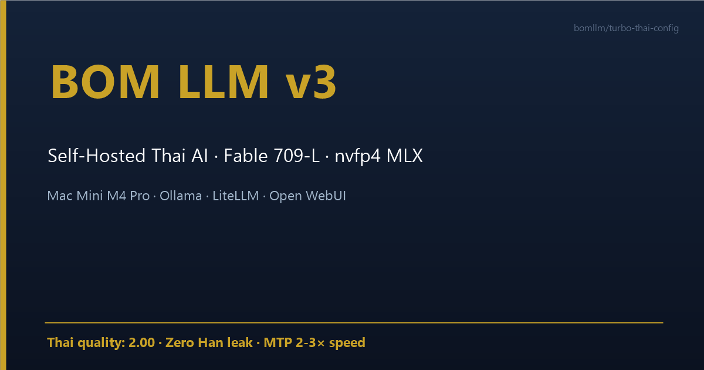
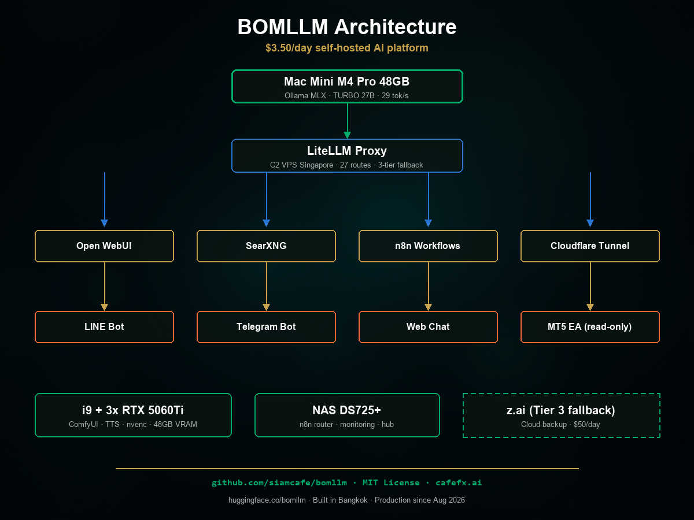
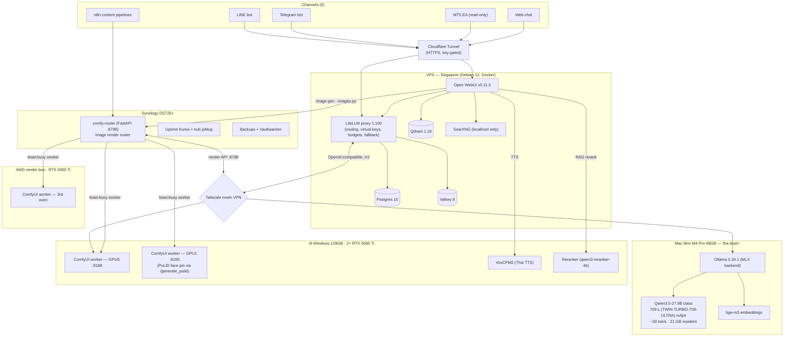
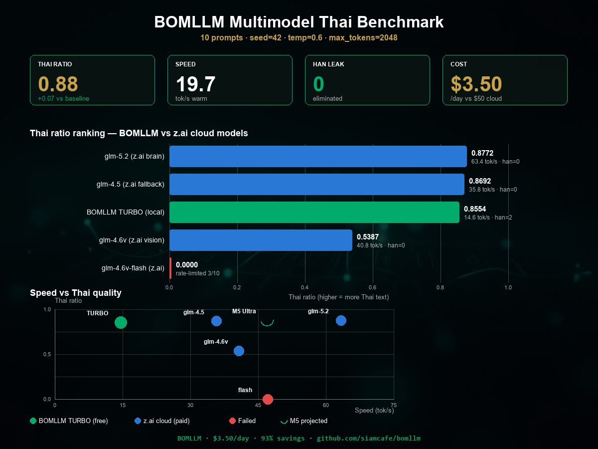

# BOMLLM



**I replaced $50/day of cloud LLM bills with a Mac Mini on my desk running at $0.54/day measured electricity.**
It has served **5 production channels** — a LINE bot, a Telegram bot, a read-only MT5 EA, web chat, and n8n content pipelines — **24/7 since August 2026**, in Thai and English.
One **Mac Mini M4 Pro 48GB** runs a 27B MLX model at **~30 tok/s** (measured, not marketing).
A small VPS fronts it with **LiteLLM + Open WebUI + SearXNG**; an i9 with 2× RTX 5060 Ti renders images and voice; a Synology NAS runs n8n and monitoring.
Everything meshes over **Tailscale**; public HTTPS via **Cloudflare Tunnel**; every API key-gated.
This repo is the full receipt: configs, sampling recipes, benchmark harness, and the cost meter.
Not a demo. Not a toy. The exact stack that answers my customers every day.
MIT licensed — clone, run `./scripts/bootstrap.sh`, and you have the VPS layer up.
The one number that matters: **$0.54/day measured whole-fleet electricity vs $50/day cloud API** — methodology inside, reproducible.
Thai-first and proud of it — but the architecture works for any language.
⬇️ คำอธิบายภาษาไทยอยู่ด้านล่าง

---

## Architecture





**Request path (chat):** channel → Cloudflare Tunnel → LiteLLM (auth, budget, route) → Tailscale → Ollama MLX on the Mac → streamed back. Web search and RAG stay on the VPS; images go through the FastAPI comfy-router on the NAS to 3 GPU workers (i9 GPU0/GPU1 + AMD, GPULAW render window 17:30–19:30 ICT); voice goes to the i9.

**Intent routing:** every message first passes `bom_intent_filter` v2 (context-aware, valve-gated via `enable_context_v2`) and is classed image / web-search / deep-think before any model sees it. v2 fixed three production bugs: a COLOR_WHITELIST (37 entries) stops color+metal words being misrouted as finance intent, FINANCE_POSITIVE (15 entries) forces web_search for finance queries, and dual-feature mutual exclusion resolves in-session image requests against outside-session searches. Every decision is logged as one `[bom_intent]` JSON line to container stdout.

**Monitoring:** Beszel v0.19.0 (hub on the NAS, agents on Mac + NAS + VPS) joins Uptime Kuma on the NAS — 10 Telegram alerts live.

**3-tier fallback** (configured in LiteLLM, measured in production):
🟢 Tier 1 Mac (free, ~80–85% of traffic) → 🟡 Tier 2 small CPU model on the VPS (free) → 🔴 Tier 3 cloud API (paid, used only when both local tiers are down — our actual cloud spend after cutover: **$0.31–$2.76/day**, see `docs/cost.md`).

---

## The cost receipt

| | Before (cloud API) | After (BOMLLM) |
|---|---|---|
| LLM inference | ~$50.00/day (z.ai GLM, metered per token) | **$0.31–$2.76/day** actual fallback spend (LiteLLM spend logs) |
| Electricity | — | **~$0.54/day** measured whole fleet (Mac + i9 + NAS + network) |
| Rate limits | yes | none |
| Data residency | third-party cloud | 100% our hardware |
| **Total** | **~$1,500/month** | **~$36–114/month** marginal (electricity + fallback + VPS) |

Cost breakdown (what the $0.54 headline does and does not include):

| Component | Cost | Basis |
|---|---|---|
| Electricity, whole fleet | **$0.54/day** | measured: wall meters + `powermetrics`/`nvidia-smi` × MEA tariff — full table in [docs/cost.md](docs/cost.md) |
| VPS (LiteLLM + Open WebUI + SearXNG front) | $10–15/month | predates BOMLLM, hosts other things — counted as sunk, not marginal per-token cost |
| z.ai fallback (tier 3, both local tiers down) | $0.31–2.76/day | LiteLLM `SpendLogs` export, first week of September 2026 |
| Hardware depreciation | separate | not in the daily number: Mac ~$2,000, payback ~6 weeks at $46.50/day saved |

Methodology — no hand-waving: electricity is measured at the wall per machine (kWh × provincial tariff), cloud spend is exported from LiteLLM's `SpendLogs` table, and the before figure comes from actual invoices. Full breakdown, watt-draw table, and the scripts that produce it: **[docs/cost.md](docs/cost.md)**. Raw structure: [benchmarks/cost-comparison.csv](benchmarks/cost-comparison.csv).

## Benchmark



## The benchmark receipt

Graded head-to-head, 50 production-style cases (LINE Q&A, signal analysis, classification, translation, edge cases), dual-graded (local grader + Gemini cross-check, Pearson 0.72):

| Metric | BOMLLM (Mac, 27B MLX) | Cloud baseline (GLM-4.5-Flash) | Verdict |
|---|---|---|---|
| Quality (1–10, graded) | **7.24** | 6.02 | ratio **1.20** ✅ |
| LINE Q&A quality | **8.93** | 6.33 | ratio **1.41** ✅ |
| Latency p50 | **5.2 s** | 35.1 s | **~7× faster** ✅ |
| Latency p95 | **19.9 s** | 85.6 s | ✅ |
| Error rate | 4% (2/50, 30 s cap) | 0% | honest ⚠️ |
| Decode speed | **30.2 tok/s** (MLX nvfp4) | 7.9 tok/s (same weights, GGUF Q4_K_M) | **+285%** from MLX alone |
| TTFT (warm) | **0.040 s** bench / 0.5–2 s production | — | |
| Thai purity (`thai_ratio`) | **0.797** (0.832 strict) with Config G | stock prompt: 0.762 | recipe in `configs/` |
| Chinese-char leakage | **15/100** replies | 43/100 on stock quant | turbo leaks *less* ✅ |

Every number above is reproducible with [benchmarks/README.md](benchmarks/README.md). Where a run needs re-measurement on your hardware, the CSV cells say `[BENCH_DATA_PENDING]` — that's deliberate: we publish the harness, not just the claims.

### The 709-L cutover (2026-09-16)

The resident model was promoted from the 735 tune to **709-L**
(TWIN-TURBO-709-ULTRA, Qwen3.5-27.8B, MLX nvfp4) after a paired production eval on 20
real articles: publishable-first-pass **0.781 vs 0.600** (paired mean
**+0.225**, W/L/T 8-1-11), wall time **141 s vs 439 s** under real
contention. Ollama upgraded 0.33.3 → 0.34.1 in the same window
(versioned install, seconds-level rollback via `ollama cp` from the
kept `-bak` alias). Full protocol and honest caveats (partial reps):
[docs/thai.md](docs/thai.md).

### Post-promotion hardening (2026-09-16)

- **LiteLLM `max_tokens` floors** on the three thin routes (`qwen38` 2048,
  `qwen38-chat` 1024, `bom-read-image` 1024) — thinking-model replies can no
  longer come back empty when a caller omits a budget.
- **NAS grind-orphan reaper** — a scheduled script now kills runaway translate
  jobs (>2 h, reparented to init) that were wedging the Mac MLX runner.
- **Rollback alias retained** — `qwen38-uni-735-bak` (previous incumbent)
  stays until 2026-09-30; restore is one `ollama cp`.
- Re-verified after a Mac reboot: sandbox 9/9, QC suite 5/5, Thai stream
  TTFT **1.94 s**, **576 GB** free after model cleanup.

## Quickstart

```bash
git clone https://github.com/siamcafe/bomllm.git
cd bomllm
cp configs/.env.example .env        # fill in YOUR values (all CHANGE_ME)
./scripts/bootstrap.sh              # VPS layer: LiteLLM + WebUI + SearXNG + DBs
```

Then point LiteLLM at your Mac's Ollama (`configs/ollama-modelfile.example` builds the model; `configs/sampling-recipe.yaml` is the validated Thai config). Full walkthrough: [docs/architecture.md](docs/architecture.md).

## Screenshots

> `[SCREENSHOT_PENDING]` — curated set lands before Show HN (tracked in [docs/show-hn.md](docs/show-hn.md)):
>
> 1. WebUI chat answering a Thai gold-price question (with web search)
> 2. LINE bot conversation on a phone
> 3. LiteLLM spend dashboard showing $0.31–$2.76/day
> 4. The Mac Mini on the desk next to the electricity meter
> 5. 90-second walkthrough video

## What this is NOT

- **Not a trading bot.** The MT5 integration is a *read-only* QC panel. Nothing here places trades. Nothing here is financial advice.
- **Not a frontier-model replacement.** For hard, novel coding problems we still reach for a frontier cloud model — that's what Tier 3 fallback is for. BOMLLM covers the ~85% of traffic that doesn't need it.
- **Not a SaaS starter kit.** Single-organization design. Invite-only users, per-user virtual keys, budgets — but no billing, no multi-tenancy.
- **Not "docker compose up and you're done" magic.** You are the SRE. We ship the runbooks we actually use ([docs/upgrade.md](docs/upgrade.md)), including the failure modes.
- **Not benchmark-chasing.** We publish production receipts: cost logs, graded Thai evals, uptime. If a leaderboard number matters to you more than your invoice, this repo will bore you.

## License matrix

This repo (glue, configs, scripts, docs) is **MIT**. Bundled components keep their own licenses — read [NOTICE](NOTICE) before you redistribute or build a service on top:

| Component | License | Watch out for |
|---|---|---|
| BOMLLM (this repo) | MIT | — |
| LiteLLM | MIT | enterprise features are commercial |
| Ollama | MIT | — |
| Open WebUI | Custom (BSD-derived + branding terms) | read upstream LICENSE before SaaS use |
| SearXNG | AGPL-3.0 | network copyleft if modified + exposed |
| ComfyUI | GPL-3.0 | copyleft on distributed modifications |
| n8n | Sustainable Use (fair-code) | **not OSI open source**; internal use only |
| Qdrant | Apache-2.0 | — |
| PostgreSQL | PostgreSQL License | — |
| Valkey | BSD-3-Clause | — |
| Tailscale client | BSD-3-Clause | coordination server is a hosted service |
| Model weights | upstream (Qwen: Apache-2.0; fine-tune: author's terms) | **not redistributed here** — pull from the original HF repo |

## Docs

- [docs/architecture.md](docs/architecture.md) — full diagram + request flows
- [docs/hardware.md](docs/hardware.md) — the M4 Pro 48GB memory map, what fits and what swaps
- [docs/cost.md](docs/cost.md) — electricity methodology + cloud invoice comparison
- [docs/thai.md](docs/thai.md) — model matrix, Thai eval protocol, known issues
- [docs/channels.md](docs/channels.md) — LINE / Telegram / WebUI / MT5 wiring (sanitized)
- [docs/security.md](docs/security.md) — threat model: bind localhost, no leaked keys
- [docs/upgrade.md](docs/upgrade.md) — how we update Ollama, LiteLLM, WebUI without downtime
- [docs/show-hn.md](docs/show-hn.md) — our own launch checklist (fork it for yours)

---

## คำอธิบายภาษาไทย (Thai summary)

**BOMLLM คืออะไร?** ระบบ AI ที่รันเองบนเครื่องตัวเอง 100% — ผมเลิกจ่ายค่า cloud LLM วันละ ~50 เหรียญ แล้วหันมาใช้ **Mac Mini M4 Pro 48GB** เครื่องเดียวบนโต๊ะ ค่าไฟรวมทั้งฟลีต ~**0.54 เหรียญ/วัน** (~530 บาท/เดือน วัดจากการใช้งานจริง)

**ใช้งานจริงตั้งแต่สิงหาคม 2026** ให้บริการ 5 ช่องทางพร้อมกัน: LINE bot, Telegram bot, MT5 EA (อ่านอย่างเดียว ไม่เทรด), เว็บแชท และ pipeline เขียนบทความผ่าน n8n — ตอบภาษาไทยและอังกฤษตลอด 24 ชม.

**เทคโนโลยีหลัก:**
- โมเดล 27B แบบ MLX (nvfp4) บน Mac — วัดจริง **~30 token/วินาที** (เร็วกว่า GGUF เดิม ~4 เท่า)
- VPS เล็กๆ รัน LiteLLM (ตัวกระจาย request + คุมงบ + fallback) + Open WebUI + SearXNG (ค้นเว็บในเครื่อง)
- เครื่อง i9 การ์ดจอ 2 ใบ ทำภาพ (ComfyUI) และเสียงพูดไทย (TTS)
- NAS รัน n8n + ระบบเฝ้าระวัง + สำรองข้อมูล
- เชื่อมทุกเครื่องด้วย Tailscale (VPN ส่วนตัว) เปิดออกเน็ตผ่าน Cloudflare Tunnel เท่านั้น ทุก API มีคีย์

**คุณภาพภาษาไทยวัดจริง:** คะแนนรวมชนะ cloud ที่เคยจ่าย (อัตราส่วน 1.20 เท่า จาก 50 เคสที่ให้กรรมการ 2 ตัวตรวจ) ตอบเร็วกว่า ~7 เท่า และมีสูตร sampling + system prompt ภาษาไทยที่ผ่านการทดสอบ A/B แล้วใน `configs/sampling-recipe.yaml`

**สิ่งที่ต้องรู้ก่อนใช้:** นี่ไม่ใช่บอทเทรด ไม่ใช่คำแนะนำการลงทุน และไม่ใช่ของเล่นที่กดปุ่มเดียวแล้วจบ — คุณต้องดูแลระบบเอง แต่เราแถม runbook ที่ใช้จริงทุกฉบับ

**ลิขสิทธิ์:** โค้ดของโปรเจกต์นี้เป็น MIT ส่วนโปรแกรมที่เอามาประกอบ (Open WebUI, n8n, SearXNG, ComfyUI ฯลฯ) อยู่ภายใต้ลิขสิทธิ์ของเจ้าของแต่ละตัว — อ่านไฟล์ [NOTICE](NOTICE) ก่อนนำไปใช้ต่อ

**อัปเดตล่าสุด:** ระบบ intent filter v2 แยก intent อัตโนมัติ (ภาพ/ค้นเว็บ/คิดลึก) พร้อม logging ทุกข้อความ

---

*Built in Bangkok. Production since 2026-08. Receipts inside.*
