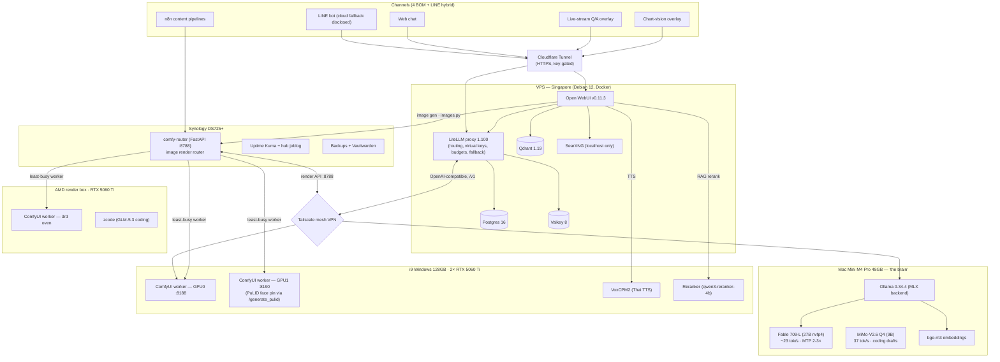

# BOMLLM


**BOM LLM v4 — Turbo + Coding**

I replaced $50/day of cloud LLM bills with a Mac Mini on my desk running at $0.54/day measured electricity.
It now does **inference, coding, image generation, voice synthesis, music, and live streaming** — all self-hosted.

One **Mac Mini M4 Pro 48GB** runs Fable 709-L (27B nvfp4 MLX) at **~23 tok/s** with MTP 2-3× speculation.
A **MiMo-V2.6 Q4 (9B)** runs alongside at **37 tok/s** for local coding drafts.
**GLM-5.3** on cloud handles production coding with 71/72 benchmark score.
An i9 with 2× RTX 5060 Ti renders images (ComfyUI + FLUX), Thai voice (SiangTTS), and music (YuE2 + ACE-Step).
Everything meshes over **Tailscale**; public HTTPS via **Cloudflare Tunnel**; every API key-gated.

This is not a demo. This is the exact stack that answers my customers every day.

## What's New in v4

### 🧠 Coding Stack (NEW)
- **GLM-5.3** (cloud) — Primary coding model: 71/72 benchmark, 8/8 tasks runnable
- **MiMo-V2.6 Q4** (local 9B) — Draft accelerator: 37 tok/s, zero network latency
- **Verified benchmark:** 8 real coding tasks (Python, MQL5, WordPress, Bash, Node.js)
- **Rule:** MiMo output never ships without test verification or GLM/human review
- [Full benchmark report →](bench/mimo_vs_glm_v1/README.md)

### ⚡ Turbo Inference
- **Fable 709-L** (DavidAU Cold-Fusion, Qwen3.8-27B base) — nvfp4 MLX
- **MTP speculation** — 2-3× effective throughput, acceptance 0.63-0.79
- **Thai quality: 2.00** — zero Han leak, completion-gated + stacked-mark
- think=true mode available (clean Thai reasoning)

### 🎙️ Production Channels
- **5 channels + LINE bot** — web chat, n8n content pipelines, live-stream Q/A overlay, chart-vision overlay, LINE (cloud fallback disclosed)
- **Live stream overlay** — Restream chat → vision analysis → 4-line Thai response → Browser Source
- **Chart analysis** — CDP capture → 709-L vision → real-time commentary

### 🎵 Creative Tools
- **Image:** ComfyUI + FLUX Dev fp8 (3 GPU workers via comfy-router)
- **Voice:** SiangTTS (VoxCPM2 LoRA, reference-only mode)
- **Music:** YuE2-3B instrumental + ACE-Step 1.5 Thai vocal

## Architecture




## Coding Benchmark

> MiMo-V2.6 Q4 (9B local) vs GLM-5.3 (cloud) — 8 identical tasks, no system prompt

| Model | Score | Runnable | Avg Time |
|-------|-------|----------|----------|
| MiMo-V2.6 Q4 (local) | **49/72** | 2/8 | 66.3s |
| GLM-5.3 (cloud) | **71/72** | 8/8 | N/A |

**MiMo safe zone:** Simple Python drafts with test assertions, scaffolding under review
**Keep on GLM:** MQL5/EA, WordPress/PHP, Bash, timing-critical code, review-free deliverables

[Detailed benchmark results →](bench/mimo_vs_glm_v1/)

## Cost

| Item | Monthly | Daily |
|------|---------|-------|
| Mac Mini M4 Pro electricity | ~$16 | $0.54 |
| VPS (Singapore) | $12 | $0.40 |
| Cloudflare (free tier) | $0 | $0 |
| Tailscale (free tier) | $0 | $0 |
| **Total self-hosted** | **~$28** | **~$0.94** |
| Cloud API equivalent | ~$1,500 | ~$50 |

**Savings: ~98% vs cloud API**

## Quick Start

```bash
git clone https://github.com/siamcafe/bomllm.git
cd bomllm
./scripts/bootstrap.sh
```

## Fleet

| Machine | Role | Key Specs |
|---------|------|-----------|
| Mac Mini M4 Pro | Brain | 48GB, Ollama 0.34.4, Fable 709-L + MiMo Q4 |
| VPS Singapore | Gateway | Docker, OWUI, LiteLLM, SearXNG |
| i9 Windows | GPU Worker | 2× RTX 5060 Ti, ComfyUI, TTS, Music |
| AMD | Coding + Render | zcode GLM-5.3, ComfyUI 3rd worker |
| Synology DS725+ | Infra | comfy-router, monitoring, n8n, backups |

## License

MIT — clone, run, deploy. See [LICENSE](LICENSE).

## Contributing

See [CONTRIBUTING.md](CONTRIBUTING.md).

---

## 🇹🇭 ภาษาไทย

**BOM LLM v4 — Turbo + Coding**

แทนที่ค่า API คลาวด์ $50/วัน ด้วย Mac Mini บนโต๊ะ $0.54/วัน (ค่าไฟจริง)

ตอนนี้ทำได้ครบ: ตอบแชท, เขียนโค้ด, สร้างรูป, สร้างเสียง, สร้างเพลง, ถ่ายทอดสด — ทั้งหมดรันเครื่องตัวเอง

**v4 ใหม่:**
- เขียนโค้ดได้แล้ว! GLM-5.3 (คลาวด์) + MiMo 9B (โลคอล 37 tok/s)
- Benchmark ผ่าน 8 โจทย์จริง: Python, MQL5, WordPress, Bash, Node.js
- Live stream overlay: วิเคราะห์กราฟ real-time ด้วย AI vision
- Thai quality 2.00, ไม่มีตัวจีนหลุด, MTP เร็ว 2-3 เท่า

Self-hosted AI ที่ใช้งานจริงทุกวัน ไม่ใช่ของเล่น 💪

#BOMLLM #SelfHostedAI #ThaiAI
