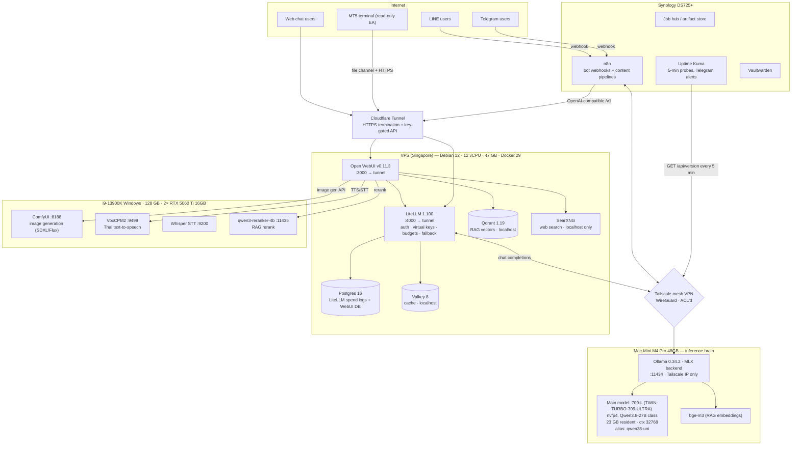

# BOMLLM Architecture

This is the full reference architecture, as running in production since
2026-08. Every box below is a real machine; every arrow is a real,
measured network path. Sanitized: real hostnames, IPs, and domains are
replaced — see `docs/security-audit.md` for what was removed and why.

## Full diagram



## Why four machines?

| Machine | Role | Why it exists |
|---|---|---|
| Mac Mini M4 Pro 48GB | LLM inference | Best tokens-per-watt-per-dollar for 27B-class models. 30 tok/s MLX vs 7.9 tok/s GGUF on the same box. Silent, ~30–65 W. |
| Linux VPS | Front of house | Public HTTPS, auth, budgets, RAG stores, web search. Cheap, always on, close to users (Singapore). |
| i9 + 2× RTX 5060 Ti | Media | Image gen and Thai TTS need CUDA. Already owned; electricity is the only marginal cost. |
| Synology NAS | Automation + ops | n8n webhooks, monitoring, backups. Low power, already running 24/7. |

A single-machine variant works fine (Mac + tunnel only). The four-machine
split is what *our* production grew into; the kit boots without the i9 and
NAS — those channels just stay disabled.

## Request flows

### 1. Web chat (most common)

```
browser → Cloudflare Tunnel → Open WebUI → LiteLLM (auth+budget+route)
        → Tailscale → Ollama MLX (Mac) → stream back the same path
```

- WebUI never talks to the Mac directly (`OLLAMA_BASE_URLS=""`) — all
  model traffic is authenticated and logged at LiteLLM.
- Web search: WebUI → SearXNG (localhost) → results injected as context.
- RAG: WebUI → bge-m3 embeddings (Mac, via LiteLLM) → Qdrant → optional
  rerank on the i9.

### 2. LINE / Telegram bots

```
LINE/Telegram platform → webhook → n8n (NAS) → workflow
  → LiteLLM /v1/chat/completions (model=thai-chat-rt, think disabled)
  → reply → platform
```

The bot route pins `think:false` and a tight `num_predict` — a reasoning
model that burns its token budget on hidden thinking returns empty
replies to users. This was a real production bug; the config in
`configs/litellm.yaml.example` encodes the fix.

### 3. MT5 EA (read-only)

The EA posts chart state over HTTPS to a dedicated LiteLLM virtual key
with a hard daily budget and a single allowed model. It cannot place
trades; it is an analysis panel. Details in `docs/channels.md`.

### 4. Content pipelines

n8n cron → LiteLLM (`bom-writer` route, long `num_predict`) → draft
articles to a staging folder. A human publishes. Nothing auto-publishes.

## Image & Intent Routing

- **comfy-router** — FastAPI on the NAS, port :8788, fronting 3 ComfyUI
  workers: i9 GPU0 :8188, i9 GPU1 :8190, and the AMD box :8188 (3rd oven).
- **Pool weights** — AMD 15% / i9 85% (configurable).
- **PuLID face-ID** — pinned to GPU1 :8190 so the identity pipeline stays
  warm on one card.
- **GPULAW** — during the 17:30–19:30 ICT peak-power window the router
  returns 503 instead of queueing render work.
- **bom_intent_filter v2** — classifies every message image / web-search /
  deep-think before dispatch; each decision is logged as `[bom_intent]`
  JSON to container stdout.

## Fallback ladder

Configured per-route in LiteLLM:

1. **Tier 1 — Mac** (free): primary 27B MLX. Carries ~80–85% of traffic.
2. **Tier 2 — VPS CPU** (free): small instruct model for keep-alive when
   the Mac is rebooting or thermally throttled.
3. **Tier 3 — cloud API** (paid): only when both local tiers fail health
   checks. Real measured spend after cutover: **$0.31–$2.76/day** across
   ~1,400–3,400 calls/day (LiteLLM `SpendLogs`, Sept 2026).

## Monitoring

- **Beszel v0.19.0** — hub on the NAS, agents on Mac + NAS + VPS.
- **Netdata** — on the Mac, bound to localhost + Tailscale only.
- **Uptime Kuma 2.5.3** — on the NAS, 5-min probes, Telegram alerts.

## Failure modes we designed around (the honest list)

| Failure | Observed in prod | Mitigation shipped in this kit |
|---|---|---|
| Two 27B models resident → swap thrash | yes (3.8 GB swap, TTFT 28–60 s) | single-model residency rule + keep-alive discipline (`docs/hardware.md`) |
| Reasoning model burns budget on hidden thinking → empty replies | yes | `think:false` pinned on bot routes |
| MLX runner not shared across aliases with different manifests | yes (~1.2 s reload per switch; 16 s cold) | one shared manifest + route-level params |
| Reranker down while RAG points at it | yes | bounded timeout, fail-open to un-reranked |
| Health-check sweeps reload evicted models for 24 h | yes | `disable_background_health_check` on unused routes |
| Cloud fallback bill creep | no (cap held) | LiteLLM `max_budget` per key + per day |

## Version pins (production, 2026-09)

| Component | Version | Note |
|---|---|---|
| Ollama | 0.34.2 | MLX backend |
| Open WebUI | v0.11.3 | CVE-fixed line |
| LiteLLM | 1.100.x | lightly patched image; stock works |
| Postgres | 16-alpine | |
| Qdrant | v1.19.1 | |
| Valkey | 8-alpine | |
| SearXNG | dated tag | never `latest` |
| ComfyUI | 0.34.0 | torch cu130 |
| Docker | 29.x | compose v2 |

Pin everything. `latest` has bitten us. Upgrade procedure:
`docs/upgrade.md`.
